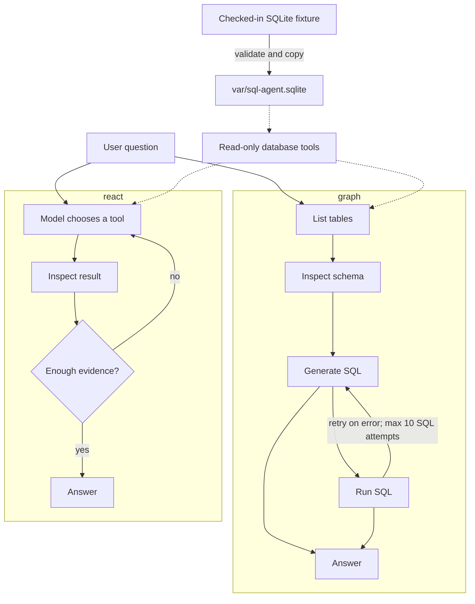

# sql-agent

A minimal [LangGraph](https://langchain-ai.github.io/langgraph/) SQL agent
that answers questions using a local SQLite database.

Two agent styles are included:

- `graph`: a fixed list-tables → schema → query → answer workflow.
- `react`: a model-directed tool loop using the same database tools.

The project is an evaluation harness for comparing these styles. It is meant
to make agent performance measurable and inspectable, not to build the best
possible SQL agent.

## How it works



Both agents can use three tools:

- `sql_db_list_tables`: list the available tables.
- `sql_db_schema`: inspect table definitions and up to three sample rows.
- `sql_db_query`: execute a read-only SQL query and return its rows.

## Evaluation metrics

The evaluation suite scores each case with the applicable metrics below:

- **Correctness** — compares the answer with the reference answer.
- **Relevance** — measures whether the answer directly addresses the question.
- **Trajectory** — assesses whether the tool-use path is sound and reasonably efficient.
- **Groundedness** — checks that claims are supported by returned SQL results.
- **SQL usage** — checks whether the agent queried the database when the case required it, and avoided SQL when it did not.
- **SQL failure limit** — checks that failed SQL attempts stay within the case's allowed limit.

## Experiment findings

The fixed graph is faster and uses fewer tokens, making it cheaper under
token-based pricing. It is strongest on straightforward data-pulling
questions that mostly translate natural language into SQL. ReAct is more
effective when the question requires analytical reasoning: it passed 12/14
insight cases versus 9/14 for the graph and scored higher on insight
correctness (0.893 versus 0.679). The graph was slightly better on data
pulling, passing 27/43 cases versus ReAct's 26/43.

### Overview metrics

| Metric             |      ReAct |      Graph | ReAct vs. Graph |
| ------------------ | ---------: | ---------: | --------------: |
| Pass rate          |      41/62 |      38/62 |         +7.895% |
| Mean latency (sec) |     11.157 |      8.821 |        +26.482% |
| Mean total tokens  | 14,650.210 | 12,103.290 |        +21.043% |

### Drill-down: data-pulling questions

Data-pulling questions ask for explicit facts or straightforward filters,
joins, and aggregations that can be answered by translating the request into
SQL.

| Metric       | ReAct | Graph | ReAct vs. Graph |
| ------------ | ----: | ----: | --------------: |
| Passed       | 26/43 | 27/43 |         -3.704% |
| Correctness  | 0.814 | 0.826 |         -1.453% |
| Relevance    | 0.930 | 0.942 |         -1.274% |
| Trajectory   | 0.919 | 0.919 |         -0.000% |
| Groundedness | 0.953 | 0.942 |         +1.168% |

### Drill-down: insight questions

Insight questions require additional analysis or reasoning over the data,
such as identifying trends, comparing groups, or interpreting derived
metrics—not just retrieving rows.

| Metric       | ReAct | Graph | ReAct vs. Graph |
| ------------ | ----: | ----: | --------------: |
| Passed       | 12/14 |  9/14 |        +33.333% |
| Correctness  | 0.893 | 0.679 |        +31.517% |
| Relevance    | 1.000 | 0.893 |        +11.982% |
| Trajectory   | 1.000 | 0.893 |        +11.982% |
| Groundedness | 1.000 | 0.929 |         +7.643% |

## Run, evaluate, and test

Install [uv](https://docs.astral.sh/uv/) if needed, then install dependencies:

```bash
uv sync
cp .env.example .env
# Set DEEPSEEK_API_KEY in .env
```

Create the runtime database and verify it:

```bash
uv run python data/seed_db.py
uv run python data/smoke_query.py
```

Ask a question. The CLI defaults to ReAct; select the fixed graph explicitly
when comparing workflows:

```bash
uv run python -m sql_agent.main "Who is the fastest driver?"
uv run python -m sql_agent.main --agent-type graph "Who is the fastest driver?"
uv run python -m sql_agent.main "How many races are in the database?" --output runs/manual.json
```

For manual database exploration:

```bash
sqlite3 -readonly var/sql-agent.sqlite
```

Run the evaluation suite for either workflow:

```bash
uv run python -m evals.runner --agent-type graph
uv run python -m evals.runner --agent-type react
```

Each evaluation writes an ignored, timestamped JSON artifact under `runs/`.
Run the local checks with:

```bash
uv run pytest -q
uv run python data/seed_db.py
uv run python data/smoke_query.py
```

## Data provenance

The fixture is the official Spider `formula_1` SQLite database. Spider covers
13 tables for races, drivers, constructors, results, standings, qualifying,
pit stops, and lap times. The data ends in 2018 and is not live Formula 1 data.

Source: [Spider project page](https://yale-lily.github.io/spider), which links
to the official [`spider_data.zip` archive](https://drive.google.com/file/d/1403EGqzIDoHMdQF4c9Bkyl7dZLZ5Wt6J/view?usp=sharing).
Spider is released under CC BY-SA 4.0.

- SQLite source: `data/database/formula_1/formula_1.sqlite`
- SQLite SHA-256: `fb6dad97c0a4da22f01bdf817a77fe8f6b6559554661ff0120b40cb81b8c3b68`
- Archive SHA-256: `00636695dabed6b5f4b8328a16b13e069a2f16591d5efcce57660669c85b121b`

Verify the checked-in fixture with:

```bash
shasum -a 256 data/database/formula_1/formula_1.sqlite
```

To add a dataset, preserve the `data/database/<database_id>/` layout, record
its source, license, size, and SHA-256, validate it with `PRAGMA quick_check`,
and add a representative smoke query. Keep source fixtures immutable and use
`var/` for runtime copies.
