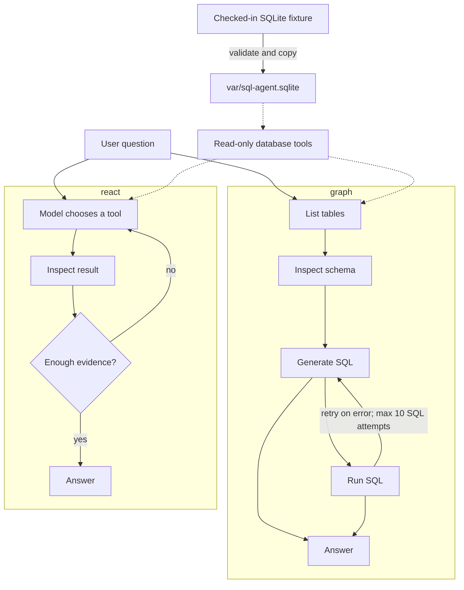

# sql-agent

A minimal [LangGraph](https://langchain-ai.github.io/langgraph/) SQL agent
that answers questions using a local SQLite database.

Two agent styles are included:

- `graph`: a fixed list-tables → schema → query → answer workflow.
- `react`: a model-directed tool loop using the same database tools.

The project is an evaluation harness for comparing these styles. It is meant
to make agent performance measurable and inspectable, not to build the best
possible SQL agent.

## How it works



Both agents can use three tools:

- `sql_db_list_tables`: list the available tables.
- `sql_db_schema`: inspect table definitions and up to three sample rows.
- `sql_db_query`: execute a read-only SQL query and return its rows.

## Evaluation suite

The evaluation dataset contains 250 cases grouped into:

- 100 `basic` cases for SQL questions which test simple data pulling.
- 100 `advanced` cases for SQL questions which test analytical thinking.
- 50 `behavioral` cases for handling of missing data, ambiguity, scope, and safety.

Each case is scored based on the following metrics:

- **Correctness** — compares the answer with the reference answer.
- **Relevance** — measures whether the answer directly addresses the question.
- **Trajectory** — assesses whether the tool-use path is sound and reasonably efficient.
- **Groundedness** — checks that claims are supported by returned SQL results.
- **SQL usage** — checks whether the agent queried the database when the case required it, and avoided SQL when it did not.
- **SQL failure limit** — checks that failed SQL attempts stay within the case's allowed limit.

## Experiment findings

The latest full-suite comparison uses 250 cases: 100 `basic`, 100 `advanced`, and 50 `behavioral`.
The source artifacts are [here](results/graph_20260905T124343.428476.json) and [here](results/react_20260905T124428.987031.json).

### Overview metrics

ReAct is the stronger overall workflow: it passes more cases and improves
correctness, relevance, trajectory, and groundedness. The trade-off is higher
latency and token usage.

| Metric                 |           ReAct |           Graph | ReAct vs. Graph |
| ---------------------- | --------------: | --------------: | --------------: |
| Pass rate              | 138/250 (55.2%) | 121/250 (48.4%) |          +14.0% |
| Correctness            |           82.4% |           77.9% |           +5.8% |
| Relevance              |           93.8% |           91.2% |           +2.9% |
| Trajectory             |           90.6% |           86.9% |           +4.3% |
| Groundedness           |           94.8% |           87.6% |           +8.2% |
| Mean latency (sec)     |          15.723 |          12.169 |          +29.2% |
| Mean total tokens      |          22,938 |          17,644 |          +30.0% |
| Mean SQL attempts      |           3.300 |           3.736 |          -11.7% |
| Mean SQL failures      |           0.116 |           0.136 |          -14.7% |
| Output tokens / second |         125.993 |         134.734 |           -6.5% |

### Drill down: Basic questions

Basic cases have modest quality gains, but ReAct's mean latency increases by
66% and mean token usage increases by 133%. SQL failures by ReAct reduce nearly to 0.

| Metric             |          ReAct |          Graph | ReAct vs. Graph |
| ------------------ | -------------: | -------------: | --------------: |
| Passed             | 66/100 (66.0%) | 64/100 (64.0%) |           +3.1% |
| Correctness        |          83.5% |          79.5% |           +5.0% |
| Relevance          |          97.0% |          94.5% |           +2.6% |
| Trajectory         |          95.5% |          93.0% |           +2.7% |
| Groundedness       |          97.5% |          96.0% |           +1.6% |
| Mean latency (sec) |         10.362 |          6.226 |          +66.4% |
| Mean total tokens  |         23,904 |         10,258 |         +133.0% |
| Mean SQL attempts  |           2.75 |           2.84 |           -3.2% |
| Mean SQL failures  |           0.03 |           0.14 |          -78.6% |

### Drill down: Advanced questions

Advanced cases are the main source of ReAct's improvement.
It passes 9 more cases, with ~95% of cases clearing the relevance, trajectory, and groundedness checks.
Correctness has also improved by 4.1%, but there is still room for improvement
with 38/100 cases receiving a non-perfect correctness score.

| Metric             |          ReAct |          Graph | ReAct vs. Graph |
| ------------------ | -------------: | -------------: | --------------: |
| Passed             | 53/100 (53.0%) | 44/100 (44.0%) |          +20.5% |
| Correctness        |          76.5% |          73.5% |           +4.1% |
| Relevance          |          96.5% |          93.0% |           +3.8% |
| Trajectory         |          94.0% |          88.5% |           +6.2% |
| Groundedness       |          95.5% |          82.0% |          +16.5% |
| Mean latency (sec) |         25.675 |         21.060 |          +21.9% |
| Mean total tokens  |         28,760 |         29,717 |           -3.2% |
| Mean SQL attempts  |           4.25 |           5.11 |          -16.8% |
| Mean SQL failures  |           0.18 |           0.17 |           +5.9% |

### Drill down: Behavioural questions

Behavioural performance also improves, but scope control remains an issue:
13 of the 40 cases that explicitly require no SQL still triggered a query in
the ReAct run.

| Metric             |         ReAct |         Graph | ReAct vs. Graph |
| ------------------ | ------------: | ------------: | --------------: |
| Passed             | 19/50 (38.0%) | 13/50 (26.0%) |          +46.2% |
| Correctness        |         92.0% |         83.7% |          +10.0% |
| Relevance          |         82.0% |         81.0% |           +1.2% |
| Trajectory         |         74.0% |         71.4% |           +3.6% |
| Groundedness       |         80.4% |         76.0% |           +5.8% |
| Mean latency (sec) |         6.543 |         6.272 |           +4.3% |
| Mean total tokens  |         9,361 |         8,267 |          +13.2% |
| Mean SQL attempts  |          2.50 |          2.78 |          -10.1% |
| Mean SQL failures  |          0.16 |          0.06 |         +166.7% |

## Run, evaluate, and test

Install [uv](https://docs.astral.sh/uv/) if needed, then install dependencies:

```bash
uv sync
cp .env.example .env
# Set DEEPSEEK_API_KEY in .env
```

Create the runtime database and verify it:

```bash
uv run python data/seed_db.py
uv run python data/smoke_query.py
```

Ask a question. The CLI defaults to ReAct; select the fixed graph explicitly
when comparing workflows:

```bash
uv run python -m sql_agent.main "Who is the fastest driver?"
uv run python -m sql_agent.main --agent-type graph "Who is the fastest driver?"
uv run python -m sql_agent.main "How many races are in the database?" --output runs/manual.json
```

For manual database exploration:

```bash
sqlite3 -readonly var/sql-agent.sqlite
```

Run the evaluation suite for either workflow:

```bash
uv run python -m evals.runner --agent-type graph
uv run python -m evals.runner --agent-type react
uv run python -m evals.runner --agent-type graph --group basic
uv run python -m evals.runner --agent-type graph --group advanced
uv run python -m evals.runner --agent-type graph --group behavioral
```

Each evaluation writes an ignored, timestamped JSON artifact under `runs/` and
updates it after every case. To resume an interrupted run, pass its path:

```bash
uv run python -m evals.runner --agent-type graph --group basic --resume runs/graph_20260905T120000.000000.json
```

Resume skips completed cases and retries cases that errored or failed
evaluation.

Run the local checks with:

```bash
uv run pytest -q
uv run python data/seed_db.py
uv run python data/smoke_query.py
```

## Data provenance

The fixture is the official Spider `formula_1` SQLite database. Spider covers
13 tables for races, drivers, constructors, results, standings, qualifying,
pit stops, and lap times. The data ends in 2018 and is not live Formula 1 data.

Source: [Spider project page](https://yale-lily.github.io/spider), which links
to the official [`spider_data.zip` archive](https://drive.google.com/file/d/1403EGqzIDoHMdQF4c9Bkyl7dZLZ5Wt6J/view?usp=sharing).
Spider is released under CC BY-SA 4.0.

- SQLite source: `data/database/formula_1/formula_1.sqlite`
- SQLite SHA-256: `fb6dad97c0a4da22f01bdf817a77fe8f6b6559554661ff0120b40cb81b8c3b68`
- Archive SHA-256: `00636695dabed6b5f4b8328a16b13e069a2f16591d5efcce57660669c85b121b`

Verify the checked-in fixture with:

```bash
shasum -a 256 data/database/formula_1/formula_1.sqlite
```

To add a dataset, preserve the `data/database/<database_id>/` layout, record
its source, license, size, and SHA-256, validate it with `PRAGMA quick_check`,
and add a representative smoke query. Keep source fixtures immutable and use
`var/` for runtime copies.
